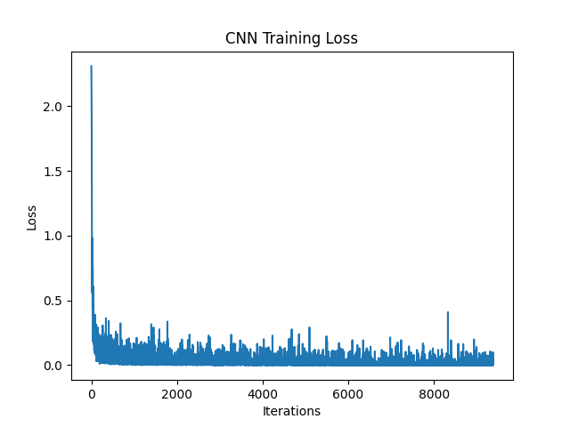
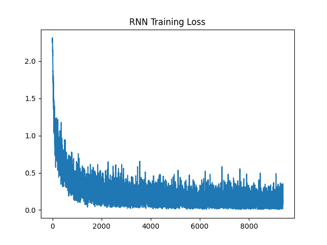

# 🧠 Handwritten Digit Classification (CNN vs RNN)

This project compares the performance of **Convolutional Neural Networks (CNN)** and **Recurrent Neural Networks (RNN)** on the MNIST dataset.

---

## 📌 Project Overview

* Dataset: MNIST (28x28 grayscale images of digits)
* Task: Image Classification (0–9 digits)
* Models Used:

  * CNN (for spatial feature extraction)
  * RNN (treating image as sequence)

---

## ⚙️ Tech Stack

* Python
* PyTorch
* SkLearn
* NumPy
* Matplotlib

---

## 📊 Results

| Model | Accuracy |
| ----- | -------- |
| CNN   | ~99%     |
| RNN   | ~94%  |

## 📊 Results Visualization

### CNN Training Loss


### RNN Training Loss


👉 CNN performs better because it captures spatial features effectively.

---

## 📂 Project Structure

```
notebooks/  → Experiments  
results/    → Output images  
```

---

## 🚀 How to Run

### 1. Clone Repo

```
git clone https://github.com/yuvrajrathore672/Handwritten-Digit-Classification.git
cd mnist-cnn-vs-rnn
```


## 🧠 Key Learnings

* Difference between CNN and RNN
* Why CNN is better for images
* PyTorch training pipeline
* DataLoader & normalization

---

## 🔥 Future Improvements

* Add LSTM / GRU
* Add confusion matrix
* Hyperparameter tuning
* Deploy with Streamlit

---

## 👨‍💻 Author

Yuvraj Singh Rathore 

---
